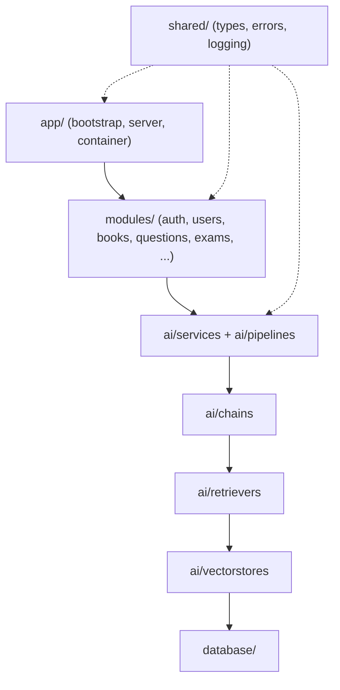
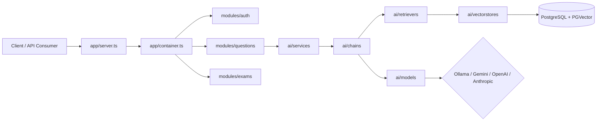
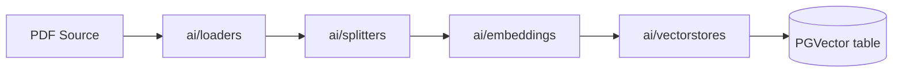
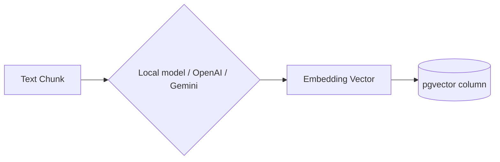
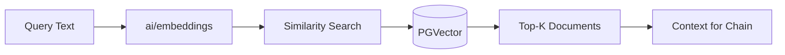
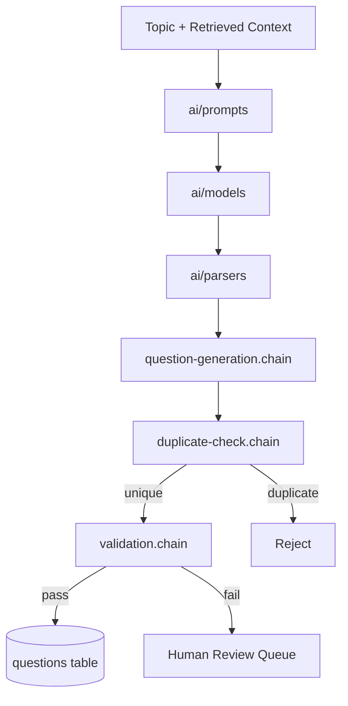
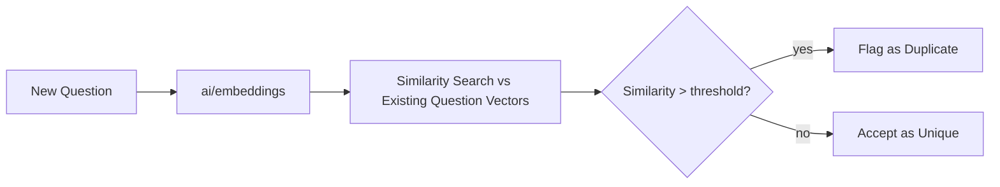
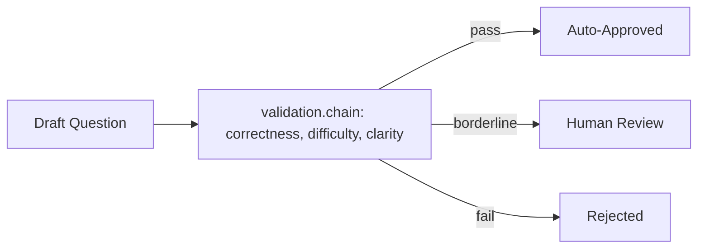

# langchan — AI-Powered Entrance Exam Platform

Enterprise-grade backend architecture for a JEE/NEET question platform built on
LangChain, TypeScript, PostgreSQL + PGVector, and multiple LLM providers
(Ollama, Gemini, OpenAI, Anthropic). This repository contains the **architecture
scaffold**: folder structure, contracts, and composition wiring. Feature logic
is implemented incrementally on top of these seams.

## Project Overview

The platform ingests source material (textbook PDFs), chunks and embeds it into
PGVector, and uses that indexed content to generate, validate, and deduplicate
exam questions with AI assistance. Every stage — ingestion, retrieval,
generation, validation — is a separate, independently testable unit connected
through explicit interfaces rather than direct imports across layers.

## Technology Stack

| Concern            | Choice                                              |
|--------------------|------------------------------------------------------|
| Language           | TypeScript (strict, ESM)                             |
| AI orchestration   | LangChain (`@langchain/core`, `@langchain/community`)|
| LLM providers      | Ollama (local), Gemini, OpenAI, Anthropic             |
| Embeddings         | Local models + provider-hosted embeddings             |
| Vector storage     | PostgreSQL + PGVector                                 |
| Runtime            | Node.js                                               |
| Testing            | Vitest                                                |

## Folder Structure

```
langchan/
├── app/          composition root: env, config, DI container, server
├── ai/           all LangChain building blocks (chains, retrievers, vectorstores, ...)
├── database/     schema, migrations, seeds, pgvector setup
├── modules/      business domains (auth, users, books, questions, exams, ...)
├── shared/       cross-cutting types/errors/logging used by 2+ layers
├── tests/        test suites, mirroring app/ai/modules structure
├── scripts/      one-off operational scripts (migrate, seed, ingest)
├── storage/      local runtime file storage (uploaded PDFs, cache) — gitignored
├── package.json
├── tsconfig.json
└── docker-compose.yml
```

> The original design brief included an empty top-level `src/`. It was dropped
> here because it held nothing and every real folder already sits at the
> repository root — an empty directory with no purpose is not scaffolding, it's
> noise.

### Folder responsibilities

- **`app/`** — the only place that knows how to *start* the process: reads env,
  builds config, constructs the DI container, boots the HTTP server. Nothing
  else in the repo should read `process.env` directly.
- **`ai/`** — every LangChain primitive, organized by kind (chains, prompts,
  parsers, models, embeddings, vectorstores, loaders, splitters, retrievers,
  memory, documents, templates, callbacks, cache, services, pipelines, utils,
  constants). This is the only layer allowed to import LangChain packages.
- **`database/`** — schema definitions, migrations, seed data, and PGVector
  extension/index setup. No business logic; just structure and DDL.
- **`modules/`** — one folder per business domain. Each module composes `ai/`
  services and `database/` access into use cases; modules do not import each
  other directly.
- **`shared/`** — code needed by two or more of the layers above (shared types,
  error classes, logger). If only one layer needs it, it belongs in that
  layer, not here.
- **`tests/`**, **`scripts/`**, **`storage/`** — supporting concerns: test
  suites, operational one-off scripts, and local runtime file storage.

## Layered Architecture & Dependency Flow

Dependencies only flow downward. A layer may depend on anything below it, never
above it or sideways across siblings at the same level (e.g. `modules/questions`
must not import from `modules/exams`).



No circular dependencies are permitted. `shared/` is depended *on*, never
depends on anything above it — that would make it not shared.

## Application Architecture



## Data Flow Pipelines

### Document Ingestion Pipeline

PDFs are loaded, split into chunks sized for embedding, embedded, and written
to PGVector alongside metadata (book, chapter, subject) needed for filtered
retrieval later.



### Embedding Pipeline



### Retriever Pipeline



### Question Generation Pipeline



### Duplicate Detection Pipeline



### Validation Pipeline



## Caching Strategy

`ai/cache/` holds LLM response caching (exact-match and semantic) so repeated
prompts — common during question review/regeneration — don't re-pay model
latency or cost. Cache keys should include model name, prompt hash, and
temperature so cached results stay correct across provider/parameter changes.

## Logging Strategy

Logging is a `shared/` concern: a single logger instance is constructed once in
`app/container.ts` and injected wherever needed. `ai/callbacks/` hooks into
LangChain's callback system to log token usage, latency, and chain
start/end/error events without instrumenting every chain by hand.

## Testing Strategy

`tests/` mirrors the source tree (`tests/ai/chains/...`, `tests/modules/...`).
Chains and services are tested against interfaces with fake/stub model and
vector-store implementations — real provider calls and a real Postgres
instance are reserved for integration tests, kept separate from unit tests so
the default `test` script stays fast and offline.

## Development Workflow

1. Copy `.env.example` to `.env` and fill in provider keys / `DATABASE_URL`.
2. `docker compose up -d` to start Postgres (with PGVector) and Ollama.
3. `npm run dev` runs the current entrypoint, `src/app/main.ts` — see
   "Sprint S1" below for what that verifies today. The enterprise `app/server.ts`
   HTTP server is scaffolded but not yet implemented.
4. `npm run typecheck` and `npm test` before opening a PR.

## Naming Conventions

- Files: `kebab-case`, suffixed by role — `question-generation.chain.ts`,
  `pgvector.store.ts`, `openai.embeddings.ts`.
- Classes/interfaces: `PascalCase`. Chain classes end in `Chain`, stores end in
  `Store`, services end in `Service`.
- Every non-trivial directory exposes its public surface through `index.ts`;
  import from the folder, not the file (`@ai/chains`, not
  `@ai/chains/question-generation.chain`).

## Coding Standards

SOLID, DRY, KISS, composition over inheritance, dependency injection through
constructor parameters (no service-locator globals), strict TypeScript
(`strict: true`, no implicit `any`), ESM throughout.

## Contribution Guidelines

- Respect the dependency flow above — if a PR introduces an upward or sideways
  import, that's a design smell to fix before merging, not to silence.
- New LangChain primitives go in the matching `ai/` subfolder and get
  re-exported from its `index.ts`.
- New business domains get their own `modules/<name>/` folder rather than
  growing an existing one to cover unrelated concerns.

## Sprint S1 — LLM/DB Connection Verification (`src/`)

Before any RAG or business logic, Sprint S1 verifies the raw plumbing works:
environment loading, a real PostgreSQL connection, a Gemini-primary /
Ollama-fallback chat call, and a local embedding call — all from the terminal.
This lives in `src/` (separate from the `app/`/`ai/`/`modules/` enterprise
scaffold above, which isn't wired up yet) and is intentionally flat: no RAG,
no agents, no multi-step chains.

**Folders**: `src/config` (env loading), `src/database` (Postgres), `src/models`
(Gemini, Ollama, and the factory that picks between them), `src/embeddings`
(local embedding call), `src/services` (the one-shot prompt send), `src/utils`
(console logger), `src/app` (bootstrap + entrypoint).

### Installation

```bash
npm install
cp .env.example .env   # then fill in the values below
```

### Dependencies

`@langchain/core`, `@langchain/google-genai` (Gemini), `@langchain/ollama`
(chat + embeddings), `pg` (PostgreSQL driver), `dotenv`. All already declared
in `package.json`.

### Environment Variables

| Variable                  | Required | Purpose                                    |
|----------------------------|----------|---------------------------------------------|
| `DATABASE_URL`             | yes      | PostgreSQL connection string (`test_series_db`) |
| `GEMINI_API_KEY`           | no       | Primary provider; if unset, goes straight to Ollama |
| `OLLAMA_BASE_URL`          | no       | Default `http://localhost:11434`            |
| `OLLAMA_CHAT_MODEL`        | no       | Default `qwen3:8b`                          |
| `OLLAMA_EMBEDDING_MODEL`   | no       | Default `embeddinggemma:latest`             |

### How to run

```bash
npm run dev
```

Runs `src/app/main.ts`: loads env, connects to Postgres, picks a chat model,
loads the embedding model, sends one prompt, prints the response, exits.

### How fallback works

`src/models/llm.factory.ts` sends a cheap probe message (`"Reply with OK."`)
to Gemini first. If `GEMINI_API_KEY` is missing, or the call fails with a
signal that means the provider is down — `429`, `503`, `quota`, `rate limit`,
`RESOURCE_EXHAUSTED`, `unavailable`, or a network error — it logs the reason
and falls back to `ChatOllama` (`qwen3:8b`) instead of crashing. Any other
kind of error (e.g. a malformed request) is rethrown rather than masked.

### How PostgreSQL connects

`src/database/postgres.ts` holds a single lazily-created `pg.Pool`, built from
`DATABASE_URL`. `testConnection()` runs `SELECT NOW()` and throws if it gets
back no rows or the connection fails — there's no silent fallback for the
database, since ingestion later needs it to be real.

### How Ollama connects

`src/models/ollama.ts` builds a `ChatOllama` against `OLLAMA_BASE_URL` /
`OLLAMA_CHAT_MODEL`. `src/embeddings/embedding.ts` builds an `OllamaEmbeddings`
against the same base URL with `OLLAMA_EMBEDDING_MODEL`, embeds a sample
string, and prints the resulting vector length.

### How Gemini connects

`src/models/gemini.ts` builds a `ChatGoogleGenerativeAI` (`gemini-2.5-flash`)
with `apiKey` passed explicitly from `GEMINI_API_KEY`, rather than relying on
the SDK's default `GOOGLE_API_KEY` env lookup.

### Troubleshooting

- **`password authentication failed`** — `DATABASE_URL` credentials don't
  match your local Postgres; this is a hard failure by design, not a bug.
- **Gemini call hangs or errors oddly** — check `GEMINI_API_KEY` is set and
  valid; if you'd rather always skip it, leave the variable empty.
- **Ollama errors ("model not found")** — run `ollama pull qwen3:8b` and
  `ollama pull embeddinggemma:latest`, and confirm `ollama serve` is running
  on `OLLAMA_BASE_URL`.
- **Process doesn't exit** — `main.ts` calls `process.exit(0)` after the
  prompt completes; if you removed that, an open `pg.Pool` will keep the
  event loop alive.

## Sprint S2 — Question Generation Pipeline (`src/generation/`)

Turns Sprint S1's verified connectivity into an actual resumable
question-generation run against `test_series_db`: resolves real subject/
category/chapter/topic IDs into `storage/initial.json`, then a
scheduler/worker pair traverses category→chapter→topic, generates batches
concurrently (Gemini with an Ollama fallback), validates and logs everything,
and persists progress after every successful batch so a crash resumes
instead of restarting.

```bash
npm run prepare-config          # one-time/idempotent: resolve DB ids, hydrate progress fields
npm run generate -- --max-batches=1   # generate a bounded number of batches
```

Full architecture, data flow, decisions, and open gaps (no duplicate
detection yet, no DB insertion of generated questions yet) are in
[`docs/sprint-s2-output.md`](docs/sprint-s2-output.md).

## Future Improvements

- Add a semantic cache backend in `ai/cache/` once real usage patterns justify
  the extra moving part.
- Add streaming responses for question generation once the UI can consume
  them.
- Add a hybrid (lexical + vector) retriever in `ai/retrievers/` if pure
  similarity search proves insufficient for exam-terminology queries.
