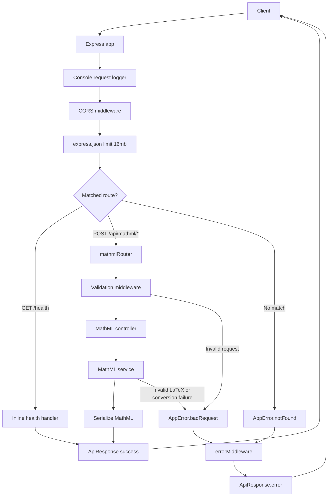
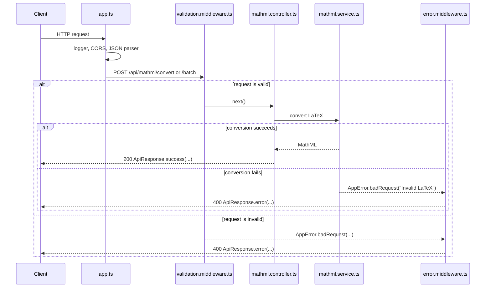

# math-jax

`math-jax` is a Node.js, Express, and TypeScript backend service that converts LaTeX expressions into MathML using `mathjax-full`.

The project exists to expose MathJax conversion through a small REST API. It supports converting one expression at a time, converting a batch of expressions, and checking whether the HTTP service is running.

## Features

- REST API built with Express.
- Health check endpoint.
- Single LaTeX-to-MathML conversion endpoint.
- Batch LaTeX-to-MathML conversion endpoint.
- Manual request validation middleware.
- Centralized success and error response wrapper.
- Custom `AppError` class for operational HTTP errors.
- Centralized error middleware.
- CORS enabled for `GET` and `POST` requests from any origin.
- JSON body parsing with a `16mb` request body limit.
- Strict TypeScript configuration.
- CommonJS-compatible MathJax imports.
- Module-scoped MathJax setup reused across requests.
- Basic console request logging.
- Graceful HTTP server shutdown on `SIGINT` and `SIGTERM`.

Features such as authentication, authorization, Swagger documentation, persistence, tests, Docker, and rate limiting are not implemented in the current codebase.

## Tech Stack

| Technology | Purpose |
|------------|---------|
| Node.js | Runtime for the compiled JavaScript service. |
| Express | HTTP server, routing, middleware, and request handling. |
| TypeScript | Static typing and strict compiler checks. |
| MathJax Full | LaTeX parsing and MathML serialization. |
| cors | Cross-origin request configuration. |
| npm | Package management and project scripts. |

## Folder Structure

```text
math-jax/
|-- .env.example
|-- .gitignore
|-- package-lock.json
|-- package.json
|-- README.md
|-- task.md
|-- tsconfig.json
|-- src/
|   |-- app.ts
|   |-- server.ts
|   |-- controllers/
|   |   `-- mathml.controller.ts
|   |-- interfaces/
|   |   `-- mathml.interface.ts
|   |-- middlewares/
|   |   |-- error.middleware.ts
|   |   `-- validation.middleware.ts
|   |-- routes/
|   |   `-- mathml.routes.ts
|   |-- services/
|   |   `-- mathml.service.ts
|   |-- types/
|   |   `-- http.types.ts
|   `-- utils/
|       |-- ApiResponse.ts
|       `-- AppError.ts
`-- dist/
```

| Path | Purpose |
|------|---------|
| `.env.example` | Documents environment variables used by the service. |
| `.gitignore` | Ignores `node_modules/`, `dist/`, `.env`, and npm debug logs. |
| `package.json` | Project metadata, scripts, dependencies, and dev dependencies. |
| `package-lock.json` | Locked npm dependency tree. |
| `tsconfig.json` | TypeScript compiler configuration. |
| `task.md` | Documentation-generation task instructions; not used by the application runtime. |
| `src/app.ts` | Builds the Express app, registers middleware, routes, fallback 404 handling, and error handling. |
| `src/server.ts` | Parses the port, starts the HTTP server, and registers shutdown/error process handlers. |
| `src/controllers/` | HTTP handlers that receive validated requests and return API responses. |
| `src/services/` | Business logic for converting LaTeX to MathML. |
| `src/routes/` | Express route definitions for MathML API routes. |
| `src/middlewares/` | Request validation and centralized error handling. |
| `src/interfaces/` | Request and response interfaces for MathML API payloads. |
| `src/types/` | Shared HTTP typing helpers. |
| `src/utils/` | Reusable response and error utilities. |
| `dist/` | Generated JavaScript output from `npm run build`; it is ignored by `.gitignore`. |

## Application Flow



The console request logger is registered before `express.json()`, so `req.body` is logged before JSON parsing has run.

## Startup Flow

1. `src/server.ts` imports the Express app from `src/app.ts`.
2. `parsePort()` reads `process.env.PORT`.
3. If `PORT` is missing or blank, the service uses port `3000`.
4. If `PORT` is present, it must be an integer from `1` through `65535`.
5. `app.listen()` starts the HTTP server.
6. `src/app.ts` registers middleware and routes in this order:
   - console request logger
   - CORS middleware
   - JSON body parser
   - `GET /health`
   - `/api/mathml` router
   - fallback 404 handler
   - centralized error middleware
7. `src/server.ts` registers handlers for `SIGINT`, `SIGTERM`, `unhandledRejection`, and `uncaughtException`.

## API Endpoints

| Method | Route | Description | Controller | Validation |
|--------|-------|-------------|------------|------------|
| `GET` | `/health` | Returns service health status. | Inline handler in `src/app.ts` | None |
| `POST` | `/api/mathml/convert` | Converts a single LaTeX expression to MathML. | `convertLatex` | `validateConvertRequest` |
| `POST` | `/api/mathml/batch` | Converts an array of LaTeX expressions to MathML. | `convertBatchLatex` | `validateBatchConvertRequest` |

Unmatched routes are converted to `AppError.notFound("Route not found")` and returned as a `404` error response.

## Request Validation

Validation is implemented manually in `src/middlewares/validation.middleware.ts`. No external validation library is used in the current codebase.

### Single Conversion Validation

`POST /api/mathml/convert` expects a JSON object:

```json
{
  "latex": "x^2",
  "display": false
}
```

Rules:

| Field | Rule |
|-------|------|
| `latex` | Required string. |
| `latex` | Must not be blank after trimming. |
| `latex` | Must be at most `10000` characters. |
| `display` | Optional boolean. |

### Batch Conversion Validation

`POST /api/mathml/batch` expects a JSON object:

```json
{
  "expressions": ["x^2", "\\frac{1}{2}"]
}
```

Rules:

| Field | Rule |
|-------|------|
| `expressions` | Required array. |
| `expressions` | Must contain at least one item. |
| `expressions` | Must contain at most `1000` items. |
| `expressions[index]` | Each item must be a string. |
| `expressions[index]` | Each item must not be blank after trimming. |
| `expressions[index]` | Each item must be at most `10000` characters. |

Validation failures throw `AppError.badRequest(...)` and return a `400` response through `errorMiddleware`.

## Error Handling

`src/utils/AppError.ts` defines an operational error class with:

| Property | Purpose |
|----------|---------|
| `statusCode` | HTTP status code used by the error middleware. |
| `isOperational` | Always set to `true` for `AppError` instances. |
| `badRequest(message)` | Creates a `400` error. |
| `notFound(message)` | Creates a `404` error. |

`src/middlewares/error.middleware.ts` handles errors as follows:

| Error Type | HTTP Status | Response |
|------------|-------------|----------|
| `AppError` | `error.statusCode` | `ApiResponse.error(error.message)` |
| Unknown error | `500` | `ApiResponse.error("Internal server error")` |

Unknown errors are logged with `console.error()` unless `NODE_ENV` is `test`.

The service throws `AppError.badRequest("Invalid LaTeX")` when MathJax conversion fails or MathJax produces an `merror` node.

## API Response Format

All successful responses use `ApiResponse.success(data, count?)`.

```ts
interface ApiSuccessResponse<T> {
  success: true;
  data: T;
  count?: number;
}
```

All handled error responses use `ApiResponse.error(message)`.

```ts
interface ApiErrorResponse {
  success: false;
  message: string;
}
```

### Health Response

```json
{
  "success": true,
  "data": {
    "status": "ok"
  }
}
```

### Single Conversion Response

Generated from the current MathJax service for `x^2`:

```json
{
  "success": true,
  "data": {
    "latex": "x^2",
    "mathml": "<math xmlns=\"http://www.w3.org/1998/Math/MathML\"><msup><mi>x</mi><mn>2</mn></msup></math>"
  }
}
```

### Batch Conversion Response

Generated from the current MathJax service for `x^2` and `\\frac{1}{2}`:

```json
{
  "success": true,
  "count": 2,
  "data": [
    {
      "latex": "x^2",
      "mathml": "<math xmlns=\"http://www.w3.org/1998/Math/MathML\"><msup><mi>x</mi><mn>2</mn></msup></math>"
    },
    {
      "latex": "\\frac{1}{2}",
      "mathml": "<math xmlns=\"http://www.w3.org/1998/Math/MathML\"><mfrac><mn>1</mn><mn>2</mn></mfrac></math>"
    }
  ]
}
```

### Error Response

Example validation failure:

```json
{
  "success": false,
  "message": "latex is required"
}
```

## Interfaces

| Interface or Type | Fields | Used By |
|-------------------|--------|---------|
| `HealthResponse` | `status: "ok"` | `GET /health` handler in `src/app.ts`. |
| `ConvertRequest` | `latex: string`, `display?: boolean` | `convertLatex` request body typing. |
| `BatchConvertRequest` | `expressions: string[]` | `convertBatchLatex` request body typing. |
| `ConvertResponse` | `latex: string`, `mathml: string` | `MathMLService.convertBatch()` return items and single conversion response data. |
| `BatchConvertResponse` | `latex: string`, `mathml: string` | Batch controller response typing. It currently has the same shape as `ConvertResponse`. |
| `ApiSuccessResponse<T>` | `success: true`, `data: T`, `count?: number` | Successful controller and health responses. |
| `ApiErrorResponse` | `success: false`, `message: string` | Error middleware responses. |
| `EmptyParams` | `Record<string, never>` | Express route request typing when no route params are expected. |
| `EmptyQuery` | `Record<string, never>` | Express route request typing when no query params are expected. |

## Service Layer

`src/services/mathml.service.ts` contains the MathJax conversion logic.

The service uses CommonJS `require()` calls for MathJax modules:

- `mathjax-full/js/mathjax.js`
- `mathjax-full/js/input/tex.js`
- `mathjax-full/js/adaptors/liteAdaptor.js`
- `mathjax-full/js/handlers/html.js`
- `mathjax-full/js/core/MmlTree/SerializedMmlVisitor.js`

It also loads TeX package configuration modules for:

- `ams`
- `newcommand`
- `mhchem`

MathJax objects are initialized at module scope:

- `adaptor`
- registered HTML handler
- `tex`
- `html`
- `mathml` serializer

`MathMLService` itself is exposed as a singleton through `MathMLService.getInstance()`.

### Conversion Process

1. Receive a LaTeX string and optional `display` boolean.
2. Call `html.convert(latex, { display })`.
3. Check whether the returned node is or contains `merror`.
4. Throw `AppError.badRequest("Invalid LaTeX")` for invalid MathJax output.
5. Serialize the MathJax node with `SerializedMmlVisitor`.
6. Remove `display="..."` attributes from the serialized MathML.
7. Remove newlines and indentation.
8. Return the compact MathML string.

`convertBatch()` maps each expression through `convert()`. The current implementation does not return per-item error objects; if one expression throws, the request fails through the shared error middleware.

## Controller Layer

`src/controllers/mathml.controller.ts` keeps HTTP handlers thin.

| Controller | Responsibility |
|------------|----------------|
| `convertLatex` | Reads `latex` and `display` from the validated request body, delegates conversion to `mathMLService.convert()`, logs the generated MathML, and returns `ApiResponse.success({ latex, mathml })`. |
| `convertBatchLatex` | Reads `expressions` from the validated request body, delegates conversion to `mathMLService.convertBatch()`, and returns `ApiResponse.success(data, data.length)`. |

Controllers do not perform request validation directly. Validation is handled before the controller by route middleware.

## Route Layer

`src/routes/mathml.routes.ts` defines a dedicated router for MathML operations:

```ts
mathmlRouter.post("/convert", validateConvertRequest, convertLatex);
mathmlRouter.post("/batch", validateBatchConvertRequest, convertBatchLatex);
```

`src/app.ts` mounts this router at:

```ts
app.use("/api/mathml", mathmlRouter);
```

Final routes:

- `POST /api/mathml/convert`
- `POST /api/mathml/batch`

API versioning is not implemented in the current codebase.

## Configuration

### Scripts

| Script | Command | Purpose |
|--------|---------|---------|
| `npm run dev` | `ts-node src/server.ts` | Runs the TypeScript server directly for development. |
| `npm run build` | `tsc -p tsconfig.json` | Compiles TypeScript from `src/` into `dist/`. |
| `npm start` | `node dist/server.js` | Runs the compiled server. |

There is no test script in the current `package.json`.

### Dependencies

| Package | Version Range | Purpose |
|---------|---------------|---------|
| `@types/cors` | `^2.8.19` | Type definitions for `cors`; currently listed under `dependencies`. |
| `cors` | `^2.8.6` | CORS middleware. |
| `express` | `^5.2.1` | HTTP framework. |
| `mathjax-full` | `^3.2.1` | MathJax conversion engine. |

### Dev Dependencies

| Package | Version Range | Purpose |
|---------|---------------|---------|
| `@types/express` | `^5.0.6` | Express type definitions. |
| `@types/node` | `^25.9.1` | Node.js type definitions. |
| `ts-node` | `^10.9.2` | Runs TypeScript directly in development. |
| `typescript` | `^6.0.3` | TypeScript compiler. |

### Environment Variables

| Variable | Default | Used By | Notes |
|----------|---------|---------|-------|
| `PORT` | `3000` | `src/server.ts` | Must be an integer between `1` and `65535` when provided. |
| `NODE_ENV` | Not set in code | `src/middlewares/error.middleware.ts` | Suppresses unknown-error logging when set to `test`. |

`.env.example` contains:

```env
PORT=3000
NODE_ENV=development
```

The current codebase does not load `.env` files automatically. Set environment variables in the shell, deployment environment, or process manager before starting the service.

### TypeScript Configuration

Important compiler settings from `tsconfig.json`:

| Setting | Value |
|---------|-------|
| `target` | `ES2022` |
| `module` | `Node16` |
| `moduleResolution` | `Node16` |
| `rootDir` | `./src` |
| `outDir` | `./dist` |
| `strict` | `true` |
| `noImplicitReturns` | `true` |
| `noUncheckedIndexedAccess` | `true` |
| `exactOptionalPropertyTypes` | `true` |
| `skipLibCheck` | `true` |

Node.js engine/version is not specified in the current `package.json`.

## Installation

```bash
git clone <repository-url>
cd math-jax
npm install
```

Run the development server:

```bash
npm run dev
```

Build the project:

```bash
npm run build
```

Run the compiled server:

```bash
npm start
```

`npm start` expects `dist/server.js` to exist, so run `npm run build` first after a clean checkout.

## Development Workflow

1. Install dependencies with `npm install`.
2. Set environment variables if needed. For example, set `PORT` before launching the process.
3. Run `npm run dev` while editing TypeScript files in `src/`.
4. Use the health endpoint to confirm the service is running.
5. Test conversion endpoints with JSON requests.
6. Run `npm run build` to compile the project.
7. Run `npm start` to execute the compiled output from `dist/`.

Example API checks:

```bash
curl http://localhost:3000/health
```

```bash
curl -X POST http://localhost:3000/api/mathml/convert \
  -H "Content-Type: application/json" \
  -d "{\"latex\":\"x^2\",\"display\":false}"
```

```bash
curl -X POST http://localhost:3000/api/mathml/batch \
  -H "Content-Type: application/json" \
  -d "{\"expressions\":[\"x^2\",\"\\\\frac{1}{2}\"]}"
```

## API Lifecycle



## Code Design Principles

| Pattern | Where It Appears | Description |
|---------|------------------|-------------|
| Controller-service separation | `controllers/`, `services/` | Controllers handle HTTP concerns; the service owns conversion logic. |
| Route-level validation | `routes/mathml.routes.ts`, `validation.middleware.ts` | Validation middleware runs before controller handlers. |
| Centralized responses | `utils/ApiResponse.ts` | Success and error responses share consistent shapes. |
| Custom operational errors | `utils/AppError.ts` | Known client errors are represented with explicit HTTP status codes. |
| Centralized error handling | `middlewares/error.middleware.ts` | One middleware converts thrown errors into API responses. |
| Singleton service | `services/mathml.service.ts` | `MathMLService.getInstance()` exports one service instance. |
| Reused MathJax setup | `services/mathml.service.ts` | MathJax adaptor, input jax, document, and serializer are module-scoped. |
| Strict typing | `tsconfig.json`, `interfaces/`, `types/` | Request, response, and shared HTTP types are explicit. |

## Future Improvements

These are recommendations only; they are not implemented in the current codebase.

- Add automated tests for validation, success conversion, invalid LaTeX, batch conversion, and 404 handling.
- Add Swagger/OpenAPI documentation generated from the real route surface.
- Replace console logging with structured logging and request IDs.
- Add explicit handling for malformed JSON parser errors.
- Add rate limiting if the API is exposed publicly.
- Add authentication and authorization if callers should be restricted.
- Add Docker and deployment configuration.
- Add CI/CD checks for install, type-check, build, and tests.
- Add metrics and tracing for request latency and MathJax conversion failures.
- Consider per-item batch result reporting if clients need partial success behavior.
