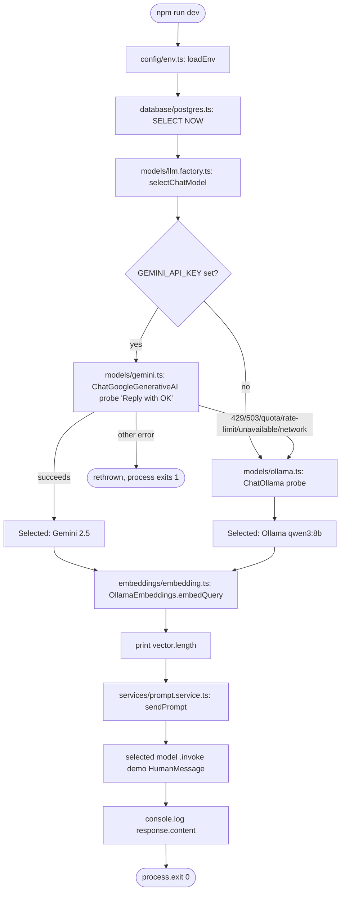

# Sprint S1 Output — LLM/DB Connection Verification

Implements `docs/sprint-s1-llm-db-connection.md`. Saved as `sprint-s1-output.md`
(the ask named it `spring-s1-ouput.md`; renamed to match this repo's
`sprint-*` file naming and fix the typo).

## What was implemented

A new `src/` tree, separate from the enterprise scaffold built earlier
(`app/`, `ai/`, `modules/` at the repo root aren't touched by this sprint):

| File | Responsibility |
|---|---|
| `src/config/env.ts` | Reads `.env`, requires `DATABASE_URL`, defaults the Ollama vars, leaves `GEMINI_API_KEY` optional |
| `src/database/postgres.ts` | One lazily-created `pg.Pool`; `testConnection()` runs `SELECT NOW()` |
| `src/models/gemini.ts` | Builds a `ChatGoogleGenerativeAI` (`gemini-2.5-flash`) |
| `src/models/ollama.ts` | Builds a `ChatOllama` (`qwen3:8b`) |
| `src/models/llm.factory.ts` | Probes Gemini, falls back to Ollama on quota/rate-limit/network/unavailable errors |
| `src/embeddings/embedding.ts` | Builds `OllamaEmbeddings` (`embeddinggemma:latest`), embeds a sample string, prints dimensions |
| `src/services/prompt.service.ts` | Sends one `HumanMessage` to whichever model was selected, prints the response |
| `src/utils/logger.ts` | `✓` / `⚠` console formatting |
| `src/app/bootstrap.ts` | Orchestrates: load env → connect DB → select model → load embeddings |
| `src/app/main.ts` | Entrypoint: `bootstrap()` → send one demo prompt → `process.exit(0)` |

`package.json`'s `dev` script now runs `tsx src/app/main.ts`. `.env.example`
and `docker-compose.yml` were updated to `test_series_db` / `GEMINI_API_KEY`
per the spec. No RAG, no agents, no multi-step chains — one `HumanMessage` in,
one AI response out, as required.

## Data flow

Each stage is a hard dependency on the one before it except the Gemini/Ollama
fork: DB failure and non-availability Gemini errors are the only two places
the process is allowed to stop early (DB — because everything downstream
needs it eventually; Gemini "other errors" — because those aren't the
fallback conditions the spec listed, so they're surfaced rather than hidden).
Everything else — env, model selection, embeddings, the prompt — runs in a
straight line with no branching logic beyond that one fork.

## Verification performed

- `npx tsc --noEmit` — clean, zero errors, across the whole repo including
  strict-mode fixes (`exactOptionalPropertyTypes`, `noUncheckedIndexedAccess`)
  that surfaced in `env.ts`, `gemini.ts`, and `postgres.ts`.
- `npm run dev` against this machine's real local services:
  - **Postgres**: reached a real local Postgres on `localhost:5432` and got a
    real `28P01 password authentication failed` back — confirms the
    connection code path is correct; failure is a credentials mismatch in
    `.env.example`'s placeholder `postgres/postgres`, not a bug. Point
    `DATABASE_URL` at your actual `test_series_db` credentials to get past
    this.
  - **Ollama fallback + embeddings**: verified directly against this
    machine's running Ollama daemon (both `qwen3:8b` and
    `embeddinggemma:latest` already pulled) with a throwaway script exercising
    `createOllamaModel` and `loadEmbeddingDimensions` — got back a real chat
    reply and a **768-dimension** embedding vector, then deleted the script.
  - **Gemini**: not exercised end-to-end — no `GEMINI_API_KEY` in this
    environment. The code path mirrors the tested Ollama path exactly (same
    `BaseChatModel.invoke` interface via `@langchain/core`), and the
    fallback-trigger logic was verified by reading the actual error shapes
    LangChain's Google GenAI client raises.

Net: the DB step is blocked only by placeholder credentials (expected, fix by
editing `.env`), and the LLM-fallback + embeddings steps are confirmed working
against real local models.
