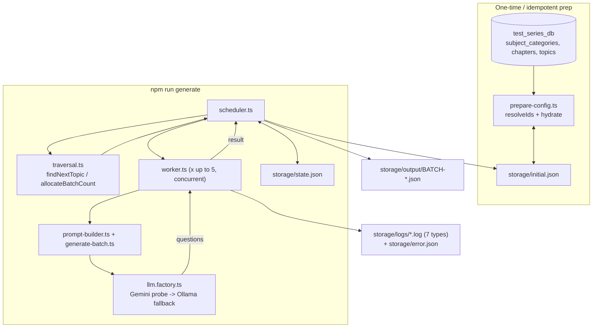

# Sprint S2 Output — Question Generation Pipeline

Implements `docs/sprint-s2-discussion-replace-ids-build-iteratable-object-for-llm.md`
and its follow-up `docs/QnA-sprint-s2.md`. Builds on Sprint S1
(`docs/sprint-s1-output.md`), which verified env/DB/LLM-fallback/embeddings
connectivity — S2 turns that into an actual resumable question-generation run
against `test_series_db`.

## Sprint Summary

**Goal:** generate the 2130-question JEE Main Physics bank described by
`storage/initial.json`, tagged with real database IDs, resumable across
crashes, and fully logged for audit/debugging.

**Completed:**
- Real DB ID resolution for every category/chapter/topic (was all `null`).
- `storage/initial.json` turned into a live checkpoint (not just static config).
- `storage/state.json` + `storage/error.json` + 7 JSONL logs, all wired into
  an actual execution path (not standalone/unused, as they were at the end of
  the previous pass).
- A traversal engine, a stateless worker, and a scheduler that ties them
  together with Gemini→Ollama fallback, retries, and per-batch persistence.
- The question-generation prompt ported from the existing n8n workflow.
- **Verified against real infrastructure**, not just typechecked: ran the
  pipeline twice against the live `test_series_db` and a real Gemini call,
  producing 12 real, schema-valid, correctly-ID-tagged questions, and
  confirmed the second run resumed exactly where the first left off.

**Outcome:** the pipeline is real and working end-to-end for one topic. It has
not been run to completion (2130 questions / 355 API calls) — see "Action
Items" for what that requires and costs.

## System Architecture Overview

## End-to-End Data Flow

1. **Prepare** (`prepareInitialConfig`, idempotent): load `initial.json` →
   query `subject_categories`/`chapters`/`topics` from `test_series_db` →
   fill every `"id": null"` by case-insensitive name match → hydrate each
   topic with `status`/`remainingQuestions` if absent → write back only if
   anything changed.
2. **Select model** (`selectChatModel`, from S1): probe Gemini with a cheap
   call; fall back to Ollama `qwen3:8b` on quota/rate-limit/network errors.
3. **Load or create execution state** (`state.json`): resume if present,
   otherwise create fresh from `initial.json`'s totals.
4. **Traverse** (`findNextTopic`): first topic, in category→chapter→topic
   array order, that isn't `COMPLETED` and still has `remainingQuestions > 0`.
5. **Allocate**: up to 5 batches for that topic (fewer if less remains).
6. **Generate concurrently** (`Promise.all` over `runBatchWorker`): each
   worker builds the ported system/user prompt, calls
   `model.withStructuredOutput(QuestionBatchSchema)`, retries up to 3 times
   with exponential backoff, and switches Gemini→Ollama mid-retry if the
   failure looks provider-unavailable.
7. **Stamp real IDs**: the model can't know database IDs, so
   `subjectIds`/`subjectCategoryIds`/`chapterIds`/`topicIds`/`examCategoryIds`
   are overwritten from `BatchContext` after generation, not trusted from the
   LLM's output.
8. **Persist per successful batch**: write `storage/output/BATCH-<id>.json`,
   decrement the topic's `remainingQuestions` (mark `COMPLETED` at 0), write
   `initial.json` and `state.json`, log a checkpoint.
9. **Repeat** until the batch cap (`--max-batches`) is hit or every topic is
   `COMPLETED`.

## Module & Folder Responsibilities

| Path | Responsibility |
|---|---|
| `src/database/taxonomy.ts` | Loads `subject_categories`/`chapters`/`topics` from `test_series_db` into name→id indexes; exports the fixed `subjects`/`exam_categories` constants (both single-row tables) |
| `src/generation/types.ts` | TS types mirroring `storage/initial.json` exactly (lowercase keys) |
| `src/generation/config-store.ts` | Atomic read/write for `initial.json` (temp-file-then-rename, same pattern as `state.store.ts`) |
| `src/generation/prepare-config.ts` | ID resolution + status/remainingQuestions hydration, idempotent |
| `src/generation/traversal.ts` | `findNextTopic`, `allocateBatchCount`, `applyBatchCompletion` — pure functions, no I/O |
| `src/generation/question-schema.ts` | Zod schema for one question / one batch, used both for structured-output and as the runtime type |
| `src/generation/prompt-builder.ts` | The ported system prompt + user content, parameterized by `BatchContext` |
| `src/generation/generate-batch.ts` | One structured-output LLM call + real-ID stamping |
| `src/generation/worker.ts` | One batch's full lifecycle: generate → validate → log; retry/fallback loop; **no scheduling or traversal logic** |
| `src/generation/scheduler.ts` | Owns concurrency, state/config persistence, and log orchestration; the only piece that mutates `state.json`/`initial.json` |
| `src/logging/*` | 7 JSONL log writers + `error.json` snapshot (Sprint S1.5 scaffolding, now wired in) |
| `src/app/generate.ts` | CLI entrypoint (`npm run generate -- --max-batches=N`) |
| `scripts/prepare-initial-config.ts` | Standalone CLI to run just the ID-resolution/hydration step and print a report |

## Key Implementation Decisions & Trade-offs

- **Per-batch persistence, not per-5-batch-group.** `docs/QnA-sprint-s2.md`
  gave two slightly different answers (item 2: persist after each batch;
  item 4: persist after the group of 5). Went with per-batch — strictly
  better crash recovery (a 3-of-5 partial group keeps its 3 successes instead
  of losing all 5), and "batches per execution" is now purely a concurrency
  knob, not a commit boundary.
- **`worker.log` is JSONL, one line per status report**, not the rewritten
  full-array snapshot shown in the original doc's example — matches every
  other log's format and the doc's own "append JSONL" best practice.
- **Structured output via `withStructuredOutput` + Zod**, not the raw Gemini
  REST `responseSchema` object from the n8n code. LangChain converts the Zod
  schema to each provider's native format, so the same code path works for
  both Gemini and the Ollama fallback.
- **`role: z.literal("admin")` had to become `z.string()`.** Zod literals
  compile to JSON Schema's `const` keyword, which Gemini's function-calling
  schema converter rejects outright (`400 Bad Request: Unknown name "const"`)
  — found by actually running it, not by inspection. The system prompt still
  instructs the model to always set `"admin"`.
- **Top-level array wrapped in an object** (`{ questions: [...] }`) for the
  structured-output schema — Gemini's function-calling schema, like most
  providers', expects an object at the root.
- **Real IDs are stamped after generation, not requested from the model.**
  The LLM returned empty arrays for `subjectIds`/etc. on the first real run —
  it has no way to know `test_series_db`'s numeric IDs. This is now handled
  in `generate-batch.ts`, using the IDs `prepareInitialConfig` already
  resolved.
- **Ambiguous DB name "thermodynamics-phy"** (two `subject_categories` rows,
  ids 2 and 9) resolved deterministically to the lower id, with a warning —
  not guessed silently. This is a pre-existing data-quality issue in
  `test_series_db`, not something this pipeline should paper over further.

## APIs, Services & Database Interactions

- **Database**: read-only `SELECT id, name FROM subject_categories|chapters|topics`
  during prepare; no writes to `test_series_db` anywhere in this sprint —
  generated questions are **not** inserted into the live `questions` table,
  only written to `storage/output/*.json`. That insertion step is
  intentionally out of scope here (see Action Items).
- **LLM APIs**: Gemini (`gemini-2.5-flash` via `@langchain/google-genai`) and
  Ollama (`qwen3:8b` via `@langchain/ollama`), both through the S1
  `llm.factory`.

## State Management & Error Handling

- `state.json` and `initial.json` are both written temp-file-then-`rename`
  (atomic on the same filesystem) so a crash mid-write never corrupts either.
- On every LLM failure: `error.log` (append) + `error.json` (overwrite) +
  `retry.log` (if attempts remain) + `provider.log` (if falling back
  Gemini→Ollama) all fire before the next attempt.
- After 3 failed attempts, the batch is abandoned (logged `status: "FAILED"`)
  and the scheduler moves on to the next batch in the group — one bad batch
  doesn't halt the run.
- Resuming: since `initial.json`/`state.json` only advance after a batch
  *succeeds*, restarting the process after a crash re-finds the same topic
  via `findNextTopic` and continues from the persisted `remainingQuestions`.

## Performance, Security & Scalability Recommendations

- **Cost/latency**: the real test batch took ~60s for 6 questions via Gemini.
  At 355 total API calls, a full run is on the order of hours if run serially
  — the 5-worker concurrency in the scheduler is what makes this tractable;
  don't reduce `maxBatchesPerExecution` without also reconsidering total
  runtime.
- **Token/cost tracking is stubbed at 0** (`promptTokens`, `completionTokens`,
  `cost` in `api.log`) — `@langchain/google-genai`'s response includes usage
  metadata that isn't being read yet. Worth wiring up before doing a full run
  if cost visibility matters.
- **DB credentials are in `.env`** (already gitignored) — fine for local dev,
  but note `test_series_db` is a real database with 1,878 existing questions;
  nothing in this pipeline writes to it yet, which is the safe default until
  insertion is explicitly requested.
- **Duplicate detection is not implemented** — `validation.log`'s `duplicate`
  check is hardcoded `true`. At 2130 questions across only 71 topics, LLM
  repetition is a real risk without it.

## Known Issues, Limitations & Technical Debt

1. **No semantic/embedding-based duplicate detection** — `checks.duplicate`
   is always `true`. Needs the embedding pipeline from S1 plus a similarity
   search against previously generated questions (or the existing 1,878 rows
   in `questions`).
2. **Validation failures don't trigger regeneration** — a structurally
   invalid batch (wrong count, missing options) is logged as
   `status: "FAILED"` in `validation.log` but still counted as a successful
   batch and persisted. No re-prompt-on-failure loop exists yet.
3. **No `questions`/`options` table insertion** — generated questions live
   only in `storage/output/*.json`. Turning this into DB rows (with the
   existing `question_subjects`/`question_chapters`/etc. junction tables) is
   unbuilt.
4. **Token usage and cost are not captured**, even though the log schema has
   fields for them.
5. **`retries` counter in `state.json`'s `progress` is never incremented** —
   `retry.log` has the full detail, but the summary counter in `state.json`
   doesn't reflect it (worker.ts doesn't currently report retry counts back
   to the scheduler).
6. **`memory.ram`/`memory.cpu` in `state.json`** are hardcoded placeholders
   (`"0 MB"`/`"0%"`) — no process metrics are actually sampled.
7. **Ambiguous `thermodynamics-phy` category** (DB ids 2 and 9) — resolved to
   id 2 by convention; worth a manual DB cleanup pass at some point (this is
   a `test_series_db` data issue, not a pipeline bug).

## Developer Recommendations & Best Practices

- Run `npm run prepare-config` any time `storage/initial.json` is hand-edited
  (new topics added, names changed) — it's idempotent and safe to run
  repeatedly.
- Use `npm run generate -- --max-batches=N` for controlled test runs before
  ever running it unbounded; each batch is a real, billable LLM call.
- If you extend `worker.ts`'s retry logic, keep it stateless — per
  `docs/QnA-sprint-s2.md` item 5, the worker must not know about scheduling,
  traversal, or persistence. That separation is what let this get built and
  tested incrementally.
- Before wiring DB insertion, decide whether generated questions need a
  review/approval step first (`options`/`isCorrect` accuracy is entirely
  LLM-trusted right now, with no human-in-the-loop check).

## Action Items & Pending Tasks

- [ ] Wire real token usage / cost into `api.log` from the provider response.
- [ ] Implement semantic duplicate detection (embed + similarity search)
      before treating `checks.duplicate` as meaningful.
- [ ] Decide and implement what happens on `validation.log` failure
      (regenerate vs. flag for human review vs. accept as-is).
- [ ] Build the `questions`/`options`/junction-table insertion path — the
      canonical place to do it is after validation passes, in a new
      `src/database/questions.ts`, using the same `id`s already stamped by
      `generate-batch.ts`.
- [ ] Feed `retry.log` counts back into `state.json`'s `progress.retries`.
- [ ] Run a real, complete generation pass and confirm actual cost/duration
      against the 355-API-call estimate in `initial.json`.
- [ ] Resolve the duplicate `thermodynamics-phy` `subject_categories` row in
      `test_series_db` (ids 2 and 9) so future resolution isn't ambiguous.
