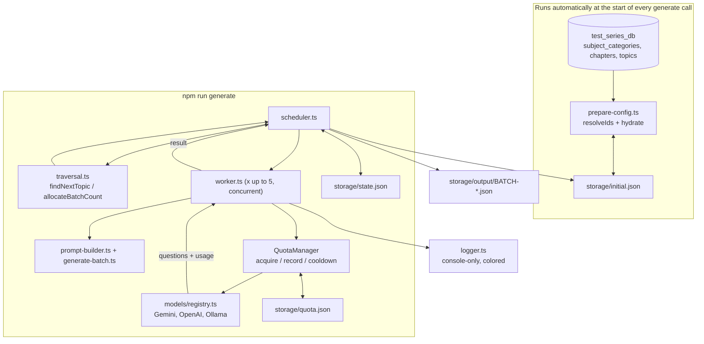

# Sprint S2 — Question Generation Pipeline

*Sprint S2 · langchan / test_series_db*

Implements `docs/sprint-s2-discussion-…` and `docs/QnA-sprint-s2.md`, on top of Sprint S1's verified connectivity. Turns a static generation plan into a resumable, logged, ID-correct run against the live `test_series_db`.

**Stats:**
- 12 — Questions generated (real)
- 2/2 — Batches succeeded
- 2 — Live bugs found & fixed
- 71/71 — Topics ID-resolved

---

## §1 Sprint Summary

**Goal:** generate the 2,130-question JEE Main Physics bank described by `storage/initial.json`, tagged with real database IDs, resumable across crashes, and fully logged for audit and debugging.

### Completed

- Real DB ID resolution for every category / chapter / topic (previously all `null`).
- `storage/initial.json` turned into a live checkpoint, not just static config.
- A traversal engine, a stateless worker, and a scheduler tying them together with retries and per-batch persistence.
- The question-generation prompt ported from the existing n8n workflow.
- **(post-review)** A shared `QuotaManager` replacing the old per-worker Gemini→Ollama probe/fallback with cross-batch RPM/TPM/RPD tracking, cooldown, and priority failover across a configurable model list.
- **(post-review)** A one-file centralized console logger replacing the seven JSONL log writers and the `error.json` snapshot.
- **(post-review)** A model registry (`config/llm.ts` + `models/registry.ts`) — adding or reordering a provider is a one-line change; OpenAI is now a registered provider alongside Gemini and Ollama.
- **(post-review)** Scaffolding removed: the unused `ai/`, `app/`, `database/`, `modules/`, `shared/` placeholder folders from earlier planning are gone.

**Verified against real infrastructure:** Not just typechecked — ran the pipeline twice against live `test_series_db` and a real Gemini call, producing 12 real, schema-valid, correctly-ID-tagged questions, and confirmed the second run resumed exactly where the first left off. Quota manager logic separately covered by 16 unit tests (`quota-manager.test.ts`) plus 4 in `worker.test.ts`.

**Outcome:** the pipeline is real and working end-to-end for one topic. It has not been run to completion (2,130 questions / 355 API calls) — see §11, Action Items, for what that requires and costs.

---

## §2 System Architecture

Diagram · prep → run → outputs



---

## §3 End-to-End Data Flow

1. **Prepare** (`prepareInitialConfig`, idempotent, now called automatically by `scheduler.ts` on every run — no separate step): load `initial.json` → query `subject_categories` / `chapters` / `topics` from `test_series_db` → fill every `"id": null` by case-insensitive name match → hydrate each topic with `status` / `remainingQuestions` if absent → write back only if anything changed.
2. **Acquire a model** (`QuotaManager.acquire`): walk `config/llm.ts`'s priority list (e.g. `gemini-3.5-flash-lite → gemini-3.1-flash-lite → gemini-2.5-flash-lite → gemini → ollama`), skipping any model that's disabled, cooling down, or RPM/TPM/RPD-exhausted; reserve quota synchronously on the first that passes. All concurrent workers share one manager instance, so a 429 on one worker cools the model down for every worker, not just the one that hit it.
3. **Load or create execution state** (`state.json`): resume if present, otherwise create fresh from `initial.json`'s totals.
4. **Traverse** (`findNextTopic`): first topic, in category → chapter → topic array order, that isn't `COMPLETED` and still has `remainingQuestions > 0`.
5. **Allocate**: up to 5 batches for that topic (fewer if less remains).
6. **Generate concurrently** (`Promise.all` over `runBatchWorker`): each worker builds the ported prompt, calls `model.withStructuredOutput(QuestionBatchSchema, { includeRaw: true })`, retries up to 3 times with exponential backoff. A 429 triggers `quota.cooldown()` and an immediate re-`acquire` onto the next healthy model in the list (including down to Ollama); a 5xx/timeout/network error retries the same model; a 4xx/validation error fails fast, no retry.
7. **Stamp real IDs**: the model can't know database IDs, so the five ID array fields are overwritten from `BatchContext` after generation — never trusted from the LLM's output.
8. **Reconcile usage** (`quota.record`): the reserved token estimate is replaced with the real `usage_metadata.total_tokens` from the response (falls back to the estimate, flagged `estimated: true`, if a provider omits it).
9. **Persist per successful batch**: write `storage/output/BATCH-<id>.json`, decrement the topic's `remainingQuestions` (mark `COMPLETED` at 0), write `initial.json` and `state.json`, persist `storage/quota.json`, log a checkpoint to the console.
10. **Repeat** until the batch cap (`--max-batches`) is hit, every topic is `COMPLETED`, or every model is out of quota (`NoModelAvailable`).

---

## §4 Module & Folder Responsibilities

| Path | Responsibility |
|---|---|
| `src/database/taxonomy.ts` | Loads `subject_categories` / `chapters` / `topics` into name→id indexes; exports the fixed `subjects` / `exam_categories` constants (both single-row tables) |
| `src/generation/types.ts` | TS types mirroring `storage/initial.json` exactly (lowercase keys) |
| `src/generation/config-store.ts` | Atomic read/write for `initial.json` (temp-file-then-rename, same pattern as `state.store.ts`) |
| `src/generation/prepare-config.ts` | ID resolution + status/remainingQuestions hydration, idempotent |
| `src/generation/traversal.ts` | `findNextTopic`, `allocateBatchCount`, `applyBatchCompletion` — pure functions, no I/O |
| `src/generation/question-schema.ts` | Zod schema for one question / one batch, used for structured-output and as the runtime type |
| `src/generation/prompt-builder.ts` | The ported system prompt + user content, parameterized by `BatchContext` |
| `src/generation/generate-batch.ts` | One structured-output LLM call + real-ID stamping |
| `src/generation/worker.ts` | One batch's full lifecycle: acquire → generate → validate → log; retry loop; owns no scheduling, traversal, or quota policy — asks the manager and reports outcomes |
| `src/generation/scheduler.ts` | Owns concurrency, state/config/quota persistence; the only piece that mutates `state.json`/`initial.json`/`quota.json`; builds the single shared `QuotaManager` for the run |
| `src/config/llm.ts` | The ordered list of model ids to try (e.g. `["gemini-3.5-flash-lite", "gemini", "ollama"]`) — edit this array to add/reorder/drop a provider, no other code changes needed |
| `src/models/registry.ts` | `MODEL_REGISTRY`: id → provider + model-name + constructor, for Gemini (multiple versions), OpenAI, and Ollama; `normalizeModelId` makes ids case/space-insensitive |
| `src/models/gemini.ts, openai.ts, ollama.ts` | One constructor per provider, called by the registry |
| `src/config/quota.ts` | Per-model RPM/TPM/RPD limits and cooldown config — no hardcoded limits inside the manager logic |
| `src/quota/quota-manager.ts` | The shared manager: `acquire` (sync check-and-reserve) / `record` / `cooldown` / `metrics`; the only thing that reads or mutates quota counters |
| `src/quota/store.ts, estimate.ts, errors.ts, types.ts` | `QuotaStore` (atomic JSON load/save), pre-flight token estimate (char/4 heuristic), provider-agnostic error classification, shared types |
| `src/logger/logger.ts` | Single centralized, colored, console-only logger (`logger.info/success/warn/error/api/retry/provider/validation/worker/checkpoint`) — replaced the seven JSONL log writers and the `error.json` snapshot; no filesystem writes |
| `src/app/generate.ts` | CLI entrypoint (`npm run generate -- --max-batches=N`) |

---

## §5 Key Implementation Decisions & Trade-offs

**Per-batch persistence, not per-5-batch-group**
`docs/QnA-sprint-s2.md` gave two slightly different answers (item 2: persist after each batch; item 4: persist after the group of 5). Went with per-batch — strictly better crash recovery, since a 3-of-5 partial group keeps its successes instead of losing all 5. "Batches per execution" is now purely a concurrency knob, not a commit boundary.

**One shared `QuotaManager`, not per-worker fallback**
The original Gemini-probe / `fallbackIds.shift()` approach was stateless per worker — worker 2 had no way to know worker 1 had just been 429'd on the same model, so all 5 concurrent workers kept hammering a rate-limited provider. A single manager instance shared across the whole run gives cross-batch cooldown: one worker's 429 cools the model down for all of them. `acquire()` has no `await` inside its check-and-reserve step, so five concurrent workers can't all pass the same RPM check and over-fire — correct without a lock, single Node instance only (see §8).

**Logging moved from 7 JSONL files to one console logger**
Replaced `src/logging/*.log.ts` (seven near-identical wrapper files, flagged by the ponytail review as 8 files doing the work of one) and the `error.json` snapshot (no reader anywhere in the repo) with a single `src/logger/logger.ts`. Console-only, colored by level, verbose in development / compact in production via `NODE_ENV`. Existing log-entry types (`ApiLogEntry`, `RetryLogEntry`, etc.) were kept so callers changed only the logging call, not the data shape.

**Provider list is config, not code — `config/llm.ts` + a registry**
Adding OpenAI (or a new Gemini version) is now a one-line entry in `MODEL_REGISTRY` plus a reorder of the priority array in `config/llm.ts` — no changes to `scheduler.ts` or `worker.ts`. Replaces the old hardcoded Gemini→Ollama-only `llm.factory` path.

**Structured output via Zod, not raw Gemini `responseSchema`**
LangChain's `withStructuredOutput` converts a Zod schema to each provider's native format, so the same code path works for both Gemini and the Ollama fallback — instead of hand-building the REST-level schema from the n8n code.

**BUG FOUND — VERIFIED LIVE: `role: z.literal("admin")` → had to become `z.string()`**
Zod literals compile to JSON Schema's `const` keyword, which Gemini's function-calling schema converter rejects outright — `400 Bad Request: Unknown name "const"`. Found by actually running it against live Gemini, not by inspection. The system prompt still instructs the model to always set `"admin"`.

**BUG FOUND — VERIFIED LIVE: Real IDs are stamped after generation, never requested from the model**
The first real run returned empty arrays for `subjectIds` / `subjectCategoryIds` / `chapterIds` / `topicIds` / `examCategoryIds` — the LLM has no way to know `test_series_db`'s numeric IDs. Fixed in `generate-batch.ts`, using the IDs `prepareInitialConfig` already resolved.

**Top-level array wrapped in an object for structured output**
`{ questions: [...] }` rather than a bare array — Gemini's function-calling schema, like most providers', expects an object at the root.

**Ambiguous DB name `"thermodynamics-phy"`**
Two `subject_categories` rows share this name (ids 2 and 9). Resolved deterministically to the lower id, with a logged warning — not guessed silently. Pre-existing `test_series_db` data-quality issue, not something this pipeline should paper over further.

---

## §6 APIs, Services & Database Interactions

**Database:** read-only `SELECT id, name FROM subject_categories|chapters|topics` during prepare. No writes to `test_series_db` anywhere in this sprint — generated questions are **not** inserted into the live `questions` table, only written to `storage/output/*.json`. That insertion step is intentionally out of scope here.

**LLM APIs:** Gemini (`gemini-2.5-flash`, plus `2.5-pro` / `3.5-flash-lite` / `3.1-flash-lite` variants, via `@langchain/google-genai`), OpenAI (`gpt-4o-mini` / `gpt-4o`, via `@langchain/openai`), and Ollama (local, via `@langchain/ollama`) — all resolved through `models/registry.ts` and gated by the shared `QuotaManager`, not a hardcoded factory.

---

## §7 State Management & Error Handling

- `state.json`, `initial.json`, and `storage/quota.json` are all written temp-file-then-rename — atomic on the same filesystem, so a crash mid-write never corrupts any of them.
- Logging is now console-only (`logger.ts`) — no more `storage/logs/*.log` JSONL files or `storage/error.json` snapshot. Every log line carries timestamp, execution/worker id, provider, model, batch, and current state; verbosity switches on `NODE_ENV`.
- On a 429: `quota.cooldown()` (Retry-After header if present, else exponential backoff capped at 240s) marks that model unavailable and the next `acquire` naturally routes to the next model in priority order — no separate fallback path to maintain.
- On 5xx/timeout/network: retried, up to `MAX_ATTEMPTS = 3` per batch. On 4xx/auth/validation: failed immediately, no retry (an unknown error type is also treated as non-retryable, so a real bug can't burn the retry budget).
- After 3 failed attempts, the batch is abandoned (`status: "FAILED"`) and the scheduler moves to the next batch in the group — one bad batch doesn't halt the run.
- Resuming: since `initial.json`/`state.json` only advance after a batch succeeds, restarting after a crash re-finds the same topic via `findNextTopic` and continues from the persisted `remainingQuestions`; `quota.json` resumes its own RPM/TPM/RPD windows the same way.

Console output — `logger.checkpoint()`, per `docs/central-logger.md`:

```
────────────────────────────────────────────
✓ CHECKPOINT
Time      : 2026-07-28 15:40
Category  : Thermodynamics · Chapter: Laws of Thermodynamics
Topic     : First Law
Generated : 6  ·  API Calls: 1  ·  Remaining: 2124
────────────────────────────────────────────
```

---

## §8 Performance, Security & Scalability

- **Cost/latency:** the real test batch took ~60s for 6 questions via Gemini. At 355 total API calls, a full serial run is on the order of hours — the 5-worker concurrency in the scheduler is what makes this tractable; don't reduce it without reconsidering total runtime.
- **(fixed) Token usage is now real:** `generate-batch.ts` requests `{ includeRaw: true }` so `usage_metadata` survives the structured-output call, flowing real `input/output/total_tokens` into `logger.api` and `quota.record`. Per-model, per-token cost ($/token pricing) is still not computed — see §9.
- **Concurrency safety is single-instance only:** `QuotaManager.acquire()` is synchronous (no `await` inside the check-and-reserve), so one Node process is race-free by construction. A multi-instance deployment (e.g. two containers sharing rate limits) needs a Redis-backed `QuotaStore` — documented as the ceiling, not built; the `QuotaStore` interface is already the seam for it.
- **DB credentials live in `.env`** (gitignored) — fine for local dev. `test_series_db` has 1,878 existing questions; nothing in this pipeline writes to it yet, which is the safe default until insertion is explicitly requested.
- **Duplicate detection is not implemented** — at 2,130 questions across only 71 topics, LLM repetition is a real risk without it.

---

## §9 Known Issues, Limitations & Technical Debt

| Severity | Issue |
|---|---|
| bug | `npm run prepare-config` is now a dangling script — it points to `scripts/prepare-initial-config.ts`, deleted in the scaffolding cleanup. Harmless in practice since `scheduler.ts` now calls `prepareInitialConfig` automatically on every `generate` run, but the script entry in `package.json` should be removed or re-pointed. |
| unbuilt | No semantic/embedding-based duplicate detection — `checks.duplicate` is always `true`. Needs the S1 embedding pipeline plus similarity search against prior batches or the existing 1,878 rows. |
| gap | Validation failures don't trigger regeneration — a structurally invalid batch is logged as a failed `logger.validation()` call but still counted as successful and persisted. |
| unbuilt | No `questions`/`options` table insertion — generated questions live only in `storage/output/*.json`. |
| minor | Per-token cost ($/token pricing × usage) still isn't computed — token counts themselves are now real (fixed), but nothing multiplies them by a price sheet. |
| minor | Quota estimate (`quota/estimate.ts`) is a char/4 heuristic, not a real tokenizer — pre-flight reservation can over/under-estimate until `record()` reconciles it with the actual response. |
| minor | `state.json`'s `progress.retries` counter is still never incremented — the quota manager now tracks `retryCount`/`fallbackCount` per model internally, but that isn't fed back into the run-level state summary. |
| minor | `memory.ram`/`memory.cpu` in `state.json` are hardcoded placeholders — no process metrics are sampled (flagged again by the ponytail review, unaddressed). |
| debt | Ponytail review (`ponytail-audit.md`) flagged ~145 lines of remaining over-engineering: always-true validation-check fields in `worker.ts`, unused telemetry fields in `state/types.ts`, duplicated atomic-JSON read/write between `config-store.ts` and `state.store.ts`, a dead `providerLabel` field on `llm.factory`, and a duplicated distribution block in `prompt-builder.ts`. The logging duplication half of that review (7 wrapper files) is already fixed by the centralized logger. |
| data | Ambiguous `thermodynamics-phy` category (DB ids 2 and 9) resolved to id 2 by convention — worth a manual `test_series_db` cleanup pass. |

---

## §10 Developer Recommendations

- `npm run prepare-config` is currently broken (see §9) — don't rely on it; `generate` already re-resolves IDs on every run, so hand-editing `storage/initial.json` is safe without a separate step once that script is fixed or removed.
- Add, remove, or reorder LLM providers in `src/config/llm.ts` — one array, no changes to `scheduler.ts`/`worker.ts`. Register a genuinely new provider in `src/models/registry.ts` first.
- Use `npm run generate -- --max-batches=N` for controlled test runs before ever running it unbounded; each batch is a real, billable LLM call.
- Run `npm test` before touching `quota-manager.ts` — 16 tests cover RPM/TPM/RPD enforcement, cooldown/backoff, priority failover, and the synchronous-reservation concurrency guarantee the whole design depends on.
- If you extend `worker.ts`'s retry logic, keep it stateless — per `docs/QnA-sprint-s2.md` item 5, the worker must not know about scheduling, traversal, or persistence; quota policy now lives in the shared `QuotaManager`, not the worker, for the same reason.
- Before wiring DB insertion, decide whether generated questions need a review/approval step first — `options`/`isCorrect` accuracy is entirely LLM-trusted right now, with no human-in-the-loop check.

---

## §11 Action Items

- [ ] Fix or remove the dangling `prepare-config` entry in `package.json` — it points to a deleted file.
- [ ] Implement semantic duplicate detection (embed + similarity search) before treating `checks.duplicate` as meaningful.
- [ ] Decide and implement what happens on a validation failure — regenerate, flag for review, or accept as-is.
- [ ] Build the `questions`/`options`/junction-table insertion path in a new `src/database/questions.ts`, using the IDs already stamped by `generate-batch.ts`.
- [ ] Feed the quota manager's per-model `retryCount`/`fallbackCount` back into `state.json`'s `progress.retries`.
- [ ] Add per-model cost accounting (price × real tokens) now that real usage is tracked.
- [ ] Swap the char/4 quota estimate for a real tokenizer if pre-flight reservation accuracy becomes a problem.
- [ ] Build a Redis-backed `QuotaStore` if this ever runs as more than one instance — the interface is already the seam for it.
- [ ] Work through the remaining `ponytail-audit.md` cleanup items (always-true validation flags, unused telemetry fields, duplicated atomic-JSON IO, dead `providerLabel`, duplicated prompt distribution block).
- [ ] Run a real, complete generation pass and confirm actual cost/duration against the 355-API-call estimate.
- [ ] Resolve the duplicate `thermodynamics-phy` `subject_categories` row (ids 2 and 9) in `test_series_db`.

---

*Sources: docs/sprint-s2-output.md · docs/sprint-s2-ratelimit-output.md · docs/central-logger.md · ponytail-audit.md · langchan*
